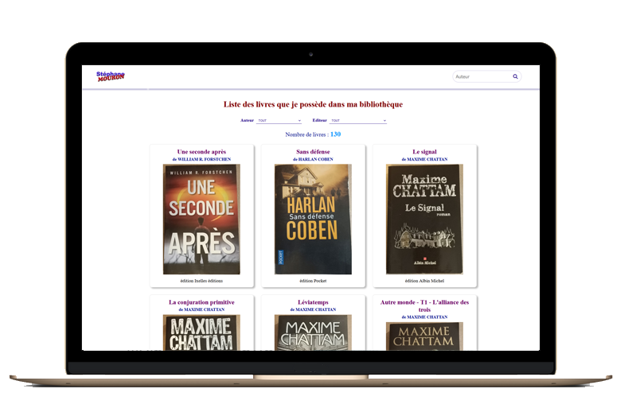

# liste livres

## But de cette création

Une de mes pations est la lecture. Mais je ne me souviens pas toujours des titres des livres que j'ai lù. Dû coup, je me retrouve parfois à acheter des livres que j'ai déjà.
Surtout quand l'éditeur à eu l'idée de changer la typo et la photo de couverture... ce qui arrive très souvent avec l'éditeur Pocket.  
Du coup, j'ai décidé de créer ce site pour que je puisse à tout moment accéder facilement à la liste de ce que j'ai déjà. Depuis un PC ou avec mon téléphone portable.
Et par la même occasion, je peux ainsi partager cette liste avec d'autres personnes.
Il n'y a pas de fioritures car je voulais un affichage le plus simple possible.

## Réalisation

Je vais en profiter pour refaire des essais de gestion de fichier JSON avec JavaScript. Mais également une gestion de filtres pour n'afficher qu'une partie des oeuvres et inclure une zone de recherche.

Le site est visible à ce lien : https://stephane-mouron.fr/perso/liste-livres/index.html
